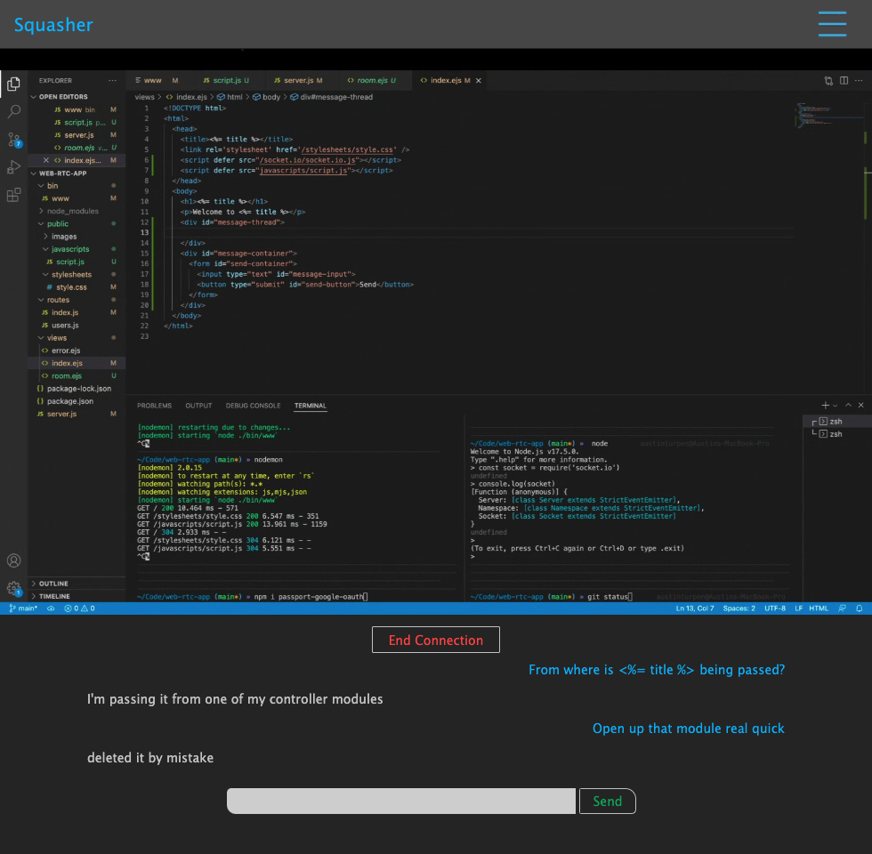

# Squasher 

---

## Description

Post your bugs and wait on replies to fix your code, or join a room and get live feedback. Users can perform basic CRUD on coding questions and answers, as well as connect with other users in real time via WebRTC and Socket.io.

## Screenshots

_Home Page (mobile):_

_Show Question / Answers:_

 

_Live Screenshare + Chat:_

## Technologies Used
- WebRTC
- Socket.io
- OAuth2
- Express + EJS
- Passport.js

## Getting Started

 - ### [APP LINK](https://squasher-seir.herokuapp.com/)

 - For now, once you open a live room, copy the url and send it to another logged in user to connect

 - NOTE: Live features may not work if your device is behind symetric NAT.
 - WebRTC audio capture is only supported on desktop with Chrome, Edge, and Opera  

## Next Steps
- Show a list of open rooms that users can click to join
- Write and host my own TURN server to ensure devices behind symetric NAT have access to live features
- Enable search feature
- Enable my replies/questions feature